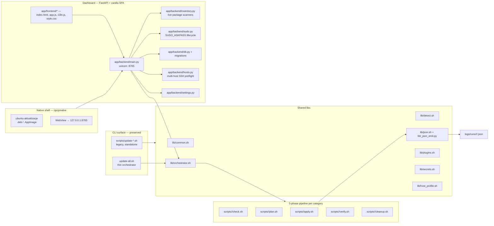
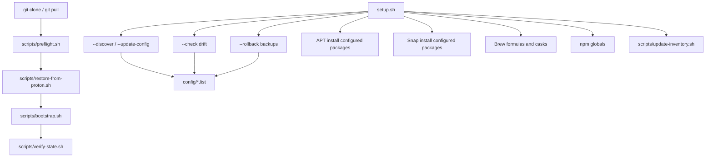

# Project Map

Generated for architecture review of `Ubuntu_Aktualizacje`.

## Hybrid CLI + Dashboard architecture (2026-04-30)



## High-Level Flow

```mermaid
flowchart TD
    User[User / systemd timer] --> Master[update-all.sh]
    Master --> Common[lib/common.sh]
    Master --> Detect[lib/detect.sh]
    Master --> Apt[scripts/update-apt.sh]
    Master --> Snap[scripts/update-snap.sh]
    Master --> Brew[scripts/update-brew.sh]
    Master --> Npm[scripts/update-npm.sh]
    Master --> Pip[scripts/update-pip.sh]
    Master --> Flatpak[scripts/update-flatpak.sh]
    Master --> Drivers[scripts/update-drivers.sh]
    Master --> Inventory[scripts/update-inventory.sh]
    Master --> Notify[scripts/notify.sh]

    Apt --> Repos[lib/repos.sh]
    Apt --> AptConfig[config/apt-packages.list]
    Apt --> RepoConfig[config/apt-repos.list]
    Snap --> SnapConfig[config/snap-packages.list]
    Brew --> BrewFormulaConfig[config/brew-formulas.list]
    Brew --> BrewCaskConfig[config/brew-casks.list]
    Npm --> NpmConfig[config/npm-globals.list]
    Pip --> PipConfig[config/pip-packages.list]
    Pip --> PipxConfig[config/pipx-packages.list]
    Flatpak --> FlatpakConfig[config/flatpak-packages.list]
    Inventory --> Apps[APPS.md]
```



## Bootstrap And Reconcile Flow



## Automation Flow

```mermaid
flowchart TD
    Timer[systemd/ubuntu-aktualizacje@USER.timer] --> Service[ubuntu-aktualizacje@USER.service]
    Service --> UpdateNoDrivers[update-all.sh --no-drivers]
    UpdateNoDrivers --> Logs[logs/systemd_update.log]
    UpdateNoDrivers --> Inventory[APPS.md]
```

## Dev Sync Flow

This flow is intentionally separate from `update-all.sh`.

```mermaid
flowchart TD
    Repo[/home/mk/Dev_Env/Ubuntu_Aktualizacje] --> Git[GitHub tracked files]
    Repo --> Export[dev-sync-export.sh]
    Export --> Excludes[config/dev-sync-excludes.txt]
    Export --> Overlay[Private overlay selection]
    Overlay --> Provider[Proton Drive / rclone provider]
    Provider --> VerifyFull[dev-sync-verify-full.sh]
    RestoreManifest[config/restore-manifest.json] --> RestorePreflight[dev-sync-restore-preflight.sh]
    RestorePreflight --> Import[dev-sync-import.sh]
    Provider --> Import
    Git --> VerifyGit[dev-sync-verify-git.sh]
    Provider --> Prune[dev-sync-prune-excluded.sh]
    Prune --> Quarantine[dev_sync_quarantine/]
    Quarantine --> Purge[dev-sync-purge-quarantine.sh --apply]

    Repo -. never delete source repo .-> Purge
```

## Current Responsibility Map

| Area | Current owner | Source of truth | Notes |
|---|---|---|---|
| Master orchestration | `update-all.sh` | `config/categories.toml` + `config/profiles.toml` | Thin wrapper around `lib/orchestrator.sh`; legacy `--only`/`--dry-run`/etc preserved. |
| Phase contract | `scripts/<cat>/{check,plan,apply,verify,cleanup}.sh` | `schemas/phase-result.schema.json` | All 8 categories × 5 phases native; legacy `scripts/update-<cat>.sh` retained for standalone CLI. |
| JSON sidecar | `lib/_json_emit.py` + `lib/json.sh` | schema v1 | Emitted by every phase to `logs/runs/<id>/<cat>/<phase>.json`. |
| Shared runtime helpers | `lib/common.sh` | helper functions | Logging, sudo keepalive (TTY/ASKPASS-aware), user-context wrappers. |
| Detection and parsing | `lib/detect.sh` | shell functions | Also parses `config/*.list`. |
| APT repositories | `lib/repos.sh` | `config/apt-repos.list` | Repo setup is idempotent. |
| Package desired state | `config/*.list` + `config/host-profiles/<host>/*.list` | first token per line | Per-host overlay supports `+name`/`-name` semantics. |
| Live inventory | `app/backend/inventory.py` | live system scan (apt/snap/brew/npm/pip/flatpak) | Returns `{name, installed, candidate, status, in_config, source}`; 60s in-memory cache. |
| Inventory snapshot | `scripts/inventory/apply.sh` → `APPS.md` | detected local state | Markdown report; gitignored. |
| Scheduled updates | `scripts/scheduler/install.sh` (or legacy `systemd/install-timer.sh`) | generated unit files | Configurable from Settings UI. |
| Snapshots | `scripts/snapshot/{create,list}.sh` | `timeshift` → `etckeeper` fallback | Opt-in via `update-all.sh --snapshot` or Settings toggle. |
| Plugins | `plugins/<id>/{manifest.toml, *.sh}` + `lib/plugins.sh` | manifest + 5-phase scripts | Sidecar uses `category=plugin:<id>`. |
| Dashboard backend | `app/backend/main.py` (FastAPI on 127.0.0.1:8765) | REST + SSE | 13 endpoints incl. `/inventory*`, `/sudo/*`, `/hosts*`, `/scheduler/*`, `/sync/*`. |
| Dashboard frontend | `app/frontend/{index.html, app.js, i18n.js, style.css}` | vanilla SPA | 8 views, EN/PL i18n, light/dark/auto theme, SVG donut+bar charts. |
| Sudo flow | `app/backend/sudo.py` + `update-all.sh` SUDO_ASKPASS branch | password held in memory | Ephemeral askpass helper in `$XDG_RUNTIME_DIR/ubuntu-aktualizacje/`. |
| Multi-host preflight | `app/backend/hosts.py` + `config/hosts.toml` | SSH BatchMode read-only | Read-only by design — no remote mutation. |
| DB migrations | `app/backend/migrations.py` | numbered + idempotent | Schema columns: snapshot_id, label. |
| Secrets | `lib/secrets.sh` + `scripts/secrets/migrate-to-libsecret.sh` | libsecret with `.env.local` fallback | `secret-tool` based; idempotent migrator. |
| Native shell | `app/tauri/src-tauri/` | Cargo + tauri.conf.json | Spawns uvicorn sidecar; produces `.deb` + `.AppImage`. |
| Dev/Proton sync | `dev-sync/`, root `dev-sync-*.sh` wrappers | Git + provider overlay | Separate from `update-all.sh`. |
| Fresh-clone recovery | `scripts/preflight.sh`, `scripts/restore-from-proton.sh`, `scripts/bootstrap.sh`, `scripts/verify-state.sh` | GitHub + provider + `config/restore-manifest.json` | One documented onboarding/recovery contract. |
| Operational run review | `docs/last-run-review.md` | latest reviewed local logs | Captures last full update result. |

## Key Gaps

1. `setup.sh` and `update-all.sh` duplicate package-manager responsibilities instead of sharing install/update/check primitives.
2. `config/*.list` cannot express groups, safety classes, channels, pins, repo dependencies, or install/update policy.
3. Desired-state enforcement differs by manager: npm/pip/flatpak install missing configured packages during update, while apt/snap/brew mostly report missing packages.
4. APT repo drift audit should be expanded to validate existing `.sources` content, not only create missing files.
5. Third-party repository package pinning is not yet modeled.
6. The systemd timer is templated consistently: `ubuntu-aktualizacje@USER.timer` -> `ubuntu-aktualizacje@USER.service`; unattended sudo policy still needs host-level configuration.
7. `--dry-run` should exercise module logic through command wrappers instead of only printing script paths.
8. CI should add `shellcheck`, `shfmt -d`, and parser/config tests.
9. Dev sync must not delete source project files; provider cleanup is plan-first and quarantine-first.

## Dev Sync Components

| File | Role |
|---|---|
| `dev-sync/dev_sync_core.py` | Config, provider abstraction, path safety, Git classification, export/import, verification. |
| `dev-sync/provider_setup.sh` | Writes `.dev_sync_config.json` for rclone/local provider setup. |
| `dev-sync/dev_sync_export.py` | Exports Git-ignored private overlay files. |
| `dev-sync/dev_sync_import.py` | Restores private overlay while skipping Git-tracked files for local and rclone providers. |
| `dev-sync/dev_sync_verify_git.py` | Verifies tracked files are clean and branch is pushed. |
| `dev-sync/dev_sync_verify_full.py` | Verifies local state is reconstructable from GitHub plus provider overlay. |
| `dev-sync/dev_sync_prune_excluded.py` | Plans and quarantines stale/generated provider files. |
| `dev-sync/dev_sync_purge_quarantine.py` | Permanently purges reviewed quarantine only with `--apply`. |
| `dev-sync/dev_sync_proton_status.py` | macOS File Provider upload/offload status helper; not primary Ubuntu/rclone verification. |
| `dev-sync/dev_sync_restore_preflight.py` | Readiness check before private-overlay restore on a fresh clone. |
