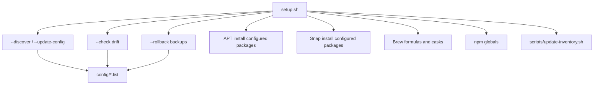

# Project Map

Generated for architecture review of `Ubuntu_Aktualizacje`.

## High-Level Flow

```mermaid
flowchart TD
    User[User / systemd timer] --> Master[update-all.sh]
    Master --> Common[lib/common.sh]
    Master --> Detect[lib/detect.sh]
    Master --> Apt[scripts/update-apt.sh]
    Master --> Snap[scripts/update-snap.sh]
    Master --> Brew[scripts/update-brew.sh]
    Master --> Npm[scripts/update-npm.sh]
    Master --> Pip[scripts/update-pip.sh]
    Master --> Flatpak[scripts/update-flatpak.sh]
    Master --> Drivers[scripts/update-drivers.sh]
    Master --> Inventory[scripts/update-inventory.sh]
    Master --> Notify[scripts/notify.sh]

    Apt --> Repos[lib/repos.sh]
    Apt --> AptConfig[config/apt-packages.list]
    Apt --> RepoConfig[config/apt-repos.list]
    Snap --> SnapConfig[config/snap-packages.list]
    Brew --> BrewFormulaConfig[config/brew-formulas.list]
    Brew --> BrewCaskConfig[config/brew-casks.list]
    Npm --> NpmConfig[config/npm-globals.list]
    Pip --> PipConfig[config/pip-packages.list]
    Pip --> PipxConfig[config/pipx-packages.list]
    Flatpak --> FlatpakConfig[config/flatpak-packages.list]
    Inventory --> Apps[APPS.md]
```



## Bootstrap And Reconcile Flow



## Automation Flow

```mermaid
flowchart TD
    Timer[systemd/ubuntu-aktualizacje.timer] --> Service[ubuntu-aktualizacje@USER.service]
    Service --> UpdateNoDrivers[update-all.sh --no-drivers]
    UpdateNoDrivers --> Logs[logs/systemd_update.log]
    UpdateNoDrivers --> Inventory[APPS.md]
```

## Dev Sync Flow

This flow is intentionally separate from `update-all.sh`.

```mermaid
flowchart TD
    Repo[/home/mk/Dev_Env/Ubuntu_Aktualizacje] --> Git[GitHub tracked files]
    Repo --> Export[dev-sync-export.sh]
    Export --> Excludes[config/dev-sync-excludes.txt]
    Export --> Overlay[Private overlay selection]
    Overlay --> Provider[Proton Drive / rclone provider]
    Provider --> VerifyFull[dev-sync-verify-full.sh]
    Git --> VerifyGit[dev-sync-verify-git.sh]
    Provider --> Prune[dev-sync-prune-excluded.sh]
    Prune --> Quarantine[dev_sync_quarantine/]
    Quarantine --> Purge[dev-sync-purge-quarantine.sh --apply]

    Repo -. never delete source repo .-> Purge
```

## Current Responsibility Map

| Area | Current owner | Source of truth | Notes |
|---|---|---|---|
| Master orchestration | `update-all.sh` | hardcoded group order | Runs inventory once via `INVENTORY_SILENT=1`. |
| Shared runtime helpers | `lib/common.sh` | helper functions | Logging, sudo keepalive, user-context wrappers. |
| Detection and parsing | `lib/detect.sh` | shell functions | Also parses `config/*.list`. |
| APT repositories | `lib/repos.sh` | `config/apt-repos.list` | Repo setup is idempotent but currently failure-tolerant. |
| Package desired state | `config/*.list` | first token per line | Comments encode grouping; metadata is not machine-readable. |
| Inventory | `scripts/update-inventory.sh` | detected local state | Generates gitignored `APPS.md`. |
| Scheduled updates | `systemd/install-timer.sh` | generated unit files | Runs `update-all.sh --no-drivers`. |
| Dev/Proton sync | `dev-sync/`, root `dev-sync-*.sh` wrappers | Git tracked files + private overlay provider | Separate from `update-all.sh`; Proton/rclone stores only ignored private overlay. |

## Key Gaps

1. `setup.sh` and `update-all.sh` duplicate package-manager responsibilities instead of sharing install/update/check primitives.
2. `config/*.list` cannot express groups, safety classes, channels, pins, repo dependencies, or install/update policy.
3. Desired-state enforcement differs by manager: npm/pip/flatpak install missing configured packages during update, while apt/snap/brew mostly report missing packages.
4. NVIDIA holds should snapshot and restore the prior hold state, preferably with a `trap`.
5. APT repo setup should fail closed when keys or source files cannot be created.
6. The systemd timer should use either a concrete service unit target or a templated timer consistently.
7. `--dry-run` should exercise module logic through command wrappers instead of only printing script paths.
8. CI should add `shellcheck`, `shfmt -d`, and parser/config tests.
9. Dev sync must not delete source project files; provider cleanup is plan-first and quarantine-first.

## Dev Sync Components

| File | Role |
|---|---|
| `dev-sync/dev_sync_core.py` | Config, provider abstraction, path safety, Git classification, export/import, verification. |
| `dev-sync/provider_setup.sh` | Writes `.dev_sync_config.json` for rclone/local provider setup. |
| `dev-sync/dev_sync_export.py` | Exports Git-ignored private overlay files. |
| `dev-sync/dev_sync_import.py` | Restores private overlay while skipping Git-tracked files for local providers. |
| `dev-sync/dev_sync_verify_git.py` | Verifies tracked files are clean and branch is pushed. |
| `dev-sync/dev_sync_verify_full.py` | Verifies local state is reconstructable from GitHub plus provider overlay. |
| `dev-sync/dev_sync_prune_excluded.py` | Plans and quarantines stale/generated provider files. |
| `dev-sync/dev_sync_purge_quarantine.py` | Permanently purges reviewed quarantine only with `--apply`. |
| `dev-sync/dev_sync_proton_status.py` | macOS File Provider upload/offload status helper; not primary Ubuntu/rclone verification. |
